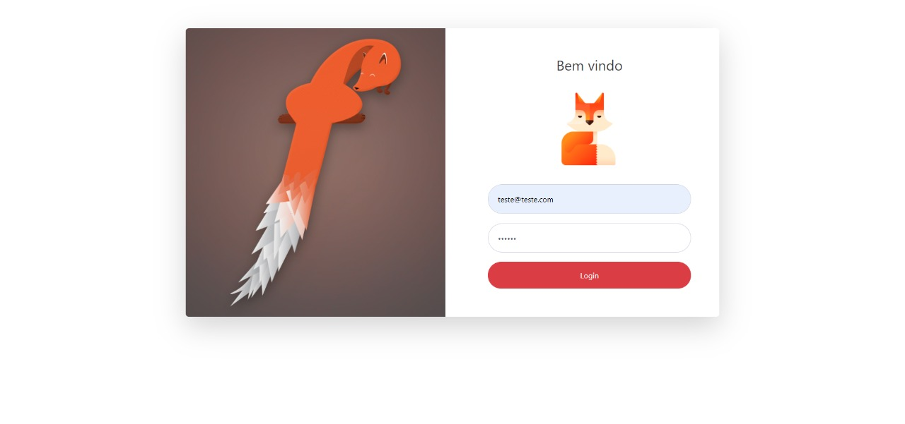
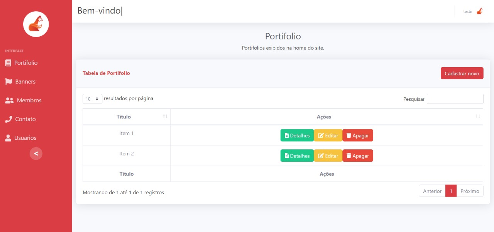
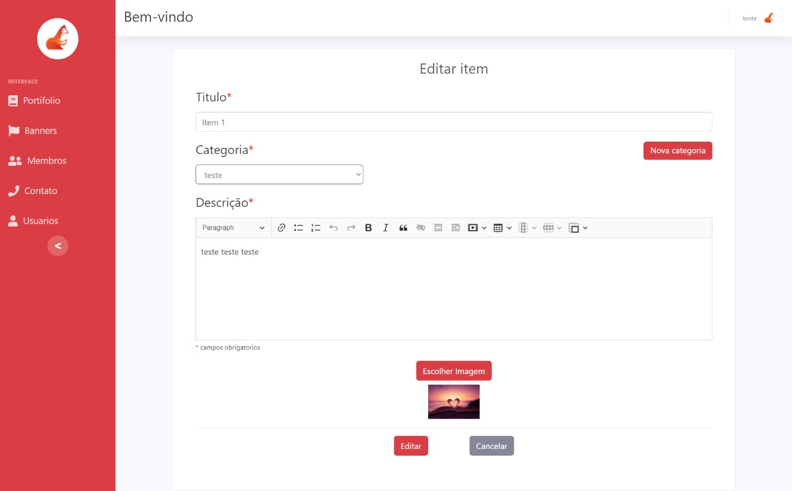
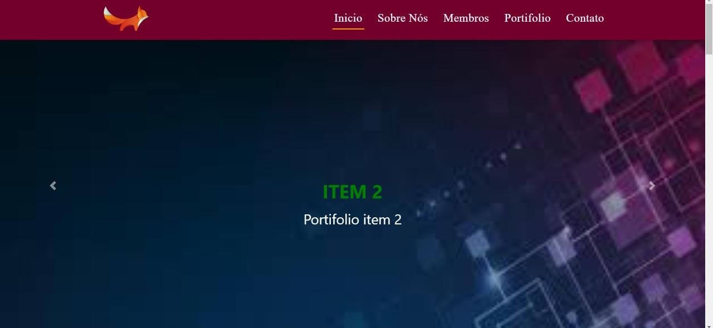

# MERN-stack-website

Site dinâmico construído com React + Node.

Utilizando Redux para gerenciamento de state.

Utilizando Multer para upload de imagens.

Autenticação com JWT.

## O site possui uma tela de login para a área do admin:

## Possui a área do admin com CRUDs para inserir informações para serem exibidas na homepage do site

## A homepage do site exibe os dados que estão cadastrados no banco de dados

